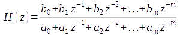
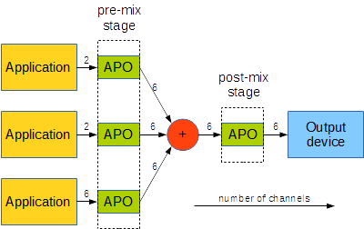

# Configuration reference
This page describes the configuration file format and the commands EqualizerAPO-XT understands. It is meant for advanced users. For an introduction or troubleshooting, see the [user documentation](Documentation). XT keeps the original Equalizer APO syntax, so configurations written for upstream Equalizer APO work unchanged.
## Configuration file format
Configuration files are read line by line. Each meaningful line has the form:

```
Command: Parameters
```

Any line that does not fit this shape is ignored silently, which is how comments work — a line starting with `#` is simply not a recognised command. Lines naming a command that does not exist are ignored as well.

Example:

```
Device: High Definition Audio Device Speakers; Benchmark
#All lines below will only be applied to the specified device and the benchmark application
Preamp: -6 db
Include: example.txt
Filter  1: ON  PK       Fc     50 Hz   Gain  -3.0 dB  Q 10.00
Filter  2: ON  PEQ      Fc     100 Hz  Gain   1.0 dB  BW Oct 0.167

Channel: L
#Additional preamp for left channel
Preamp: -5 dB
#Filters only for left channel
Include: demo.txt
Filter  1: ON  LS       Fc     300 Hz  Gain   5.0 dB

Channel: 2 C
#Filters for second(right) and center channel
Filter  1: ON  HP       Fc     30 Hz
Filter  2: ON  LPQ      Fc     10000 Hz  Q  0.400

Device: Microphone
#From here, the lines only apply to microphone devices
Filter: ON  NO       Fc     50 Hz
```

## Filtering commands
These commands change the audio on the currently selected channels directly.

### Preamp
**Syntax:** `Preamp: <Negative number> dB`

Sets a preamplification value in decibels. Use it when filters add positive gain, to keep the signal from clipping. When several preamps apply to the same channel, the effective preamp is their sum in dB.

```
Preamp: -6.5 dB
```

### Filter
**Syntax:**
```
Filter <n>: ON <Type> Fc <Frequency> Hz Gain <Gain value> dB Q <Q value>
Filter <n>: ON <Type> Fc <Frequency> Hz Gain <Gain value> dB BW Oct <Bandwidth value>
```

Adds a filter of the given type, frequency, gain and Q / bandwidth. The first form (with Q) matches Room EQ Wizard's "Generic" equalizer type; the second (with bandwidth) matches "FBQ2496". The filter number `<n>` is not interpreted and may be omitted.

The table below lists the supported filter types. In the parameter columns, **X** marks a required parameter and **O** an optional one. These cover every filter of the "Generic" and "FBQ2496" types; other equalizer types may also work if their text format matches. Note one difference: the band-pass filter here is a true band-pass with no gain (like the low/high-pass filters), unlike the DCX2496's "BP", which is really a peaking filter.

| Type | Description | Fc | Gain | Q/BW | Example |
| --- | --- | --- | --- | --- | --- |
| PK<br>Modal<br>PEQ | Peaking filter (parametric EQ) | X | X | X | `ON PK Fc 50.0 Hz Gain -10.0 dB Q 2.50`<br>`ON Modal Fc 100 Hz Gain 3.0 dB Q 5.41 T60 target 100 ms`<br>`ON PEQ Fc 100 Hz Gain 1.0 dB BW Oct 0.167` |
| LP<br>LPQ | Low-pass filter | X |  | O | `ON LP Fc 8000 Hz`<br>`ON LPQ Fc 10000 Hz Q 0.400` |
| HP<br>HPQ | High-pass filter | X |  | O | `ON HP Fc 30.0 Hz`<br>`ON HPQ Fc 20.0 Hz Q 0.500` |
| BP | Band-pass filter (not from DCX2496) | X |  | O | `ON BP Fc 1000 Hz Q 0.100` |
| LS<br>LSC *x* dB | Low-shelf filter (with centre freq.; *x* dB per octave for LSC) | X | X | O (1.2.1) | `ON LS Fc 300 Hz Gain 5.0 dB`<br>`ON LSC 10.8 dB Fc 300 Hz Gain 5.0 dB`<br>`ON LSC Fc 300 Hz Gain 5.0 dB Q 0.6473` |
| HS<br>HSC *x* dB | High-shelf filter (with centre freq.; *x* dB per octave for HSC) | X | X | O (1.2.1) | `ON HS Fc 1000 Hz Gain -3.0 dB`<br>`ON HSC 6 dB Fc 100 Hz Gain -6.0 dB`<br>`ON HSC Fc 100 Hz Gain -6.0 dB Q 0.4272` |
| LS 6dB<br>LS 12dB | Low-shelf filter (6 / 12 dB per octave, corner freq.) | X | X |  | `ON LS 6dB Fc 50.0 Hz Gain 7.2 dB`<br>`ON LS 12dB Fc 2000 Hz Gain -5.0 dB` |
| HS 6dB<br>HS 12dB | High-shelf filter (6 / 12 dB per octave, corner freq.) | X | X |  | `ON HS 6dB Fc 12000 Hz Gain 10.0 dB`<br>`ON HS 12dB Fc 500 Hz Gain 5.0 dB` |
| NO | Notch filter | X |  | O | `ON NO Fc 800 Hz` |
| AP | All-pass filter | X |  | X | `ON AP Fc 900 Hz Q 0.707` |


### Filter with custom coefficients
**Syntax:** `Filter <n>: ON IIR Order <m> Coefficients <b0> <b1> ... <bm> <a0> <a1> ... <am>`

Adds a generic IIR filter of the given order and coefficients. The number of coefficients must be `2·(order+1)`. The transfer function is shown below.

<br><em>IIR transfer function</em>

Because the coefficients usually depend on the sample rate, combine this with the [If](#if--elseif--else--endif) command or [inline expressions](#eval-and-inline-expressions) to supply the right values for the current rate. You *can* reproduce the BiQuad filters of the other types this way, but it runs slower, so it is not advisable.

```
# A lowpass biquad filter with Fc 3000 Hz for the sample rate 48 kHz
Filter: ON IIR Order 2 Coefficients 0.0380602 0.0761205 0.0380602 1.2706 -1.84776 0.729402
```

### Delay
**Syntax:**
```
Delay: <t> ms
Delay: <n> samples
```

Delays the selected channels by `t` milliseconds or `n` samples. Prefer milliseconds — they give the same delay regardless of sample rate.

```
# Delays the audio by 50.5 ms independent of sample rate
Delay: 50.5 ms
# Delays the audio by 480 samples (10 ms at 48 kHz)
Delay: 480 samples
```

### Copy
**Syntax:**
```
Copy: <Target channel>=<Factor>*<Source channel>+...
Copy: <Target channel>=<Source channel>+...
Copy: <Target channel>=<Constant value>+...
```

Replaces the target channel with the sum of the listed source channels, each with an optional factor. To add to the target instead of replacing it, include the target as one of the sources. A factor may be given in dB by appending `dB`. Several assignments can share one line if separated by spaces, so a single assignment must not contain spaces. A constant value can be used in place of a channel/factor; to keep it distinct from a numeric channel index, the constant must contain a decimal point. See the [Channel](#channel) command for channel identifiers.

```
# Adds the audio on channel R multiplied by 0.5 to channel L
Copy: L=L+0.5*R
# Replaces L by R plus C attenuated by 6 dB
Copy: L=R+-6dB*C
# Replaces channel 1 by the audio previously on R, and sets R to the constant 0.5
Copy: 1=R R=0.5
# Attention: sets L to the audio on channel 2 (not the constant 2 — no decimal point)
Copy: L=2
# Replaces the LFE channel with the left channel while muting the rest of a 5.1 system
Copy: LFE=L L=0.0 R=0.0 C=0.0 RL=0.0 RR=0.0
```

### GraphicEQ
**Syntax:** `GraphicEQ: <Frequency> <Gain (dB)>; <Frequency> <Gain (dB)>; ...`

Adds a graphic equalizer with the given bands and gains. Gains are interpolated linearly across the logarithmic frequency axis (so the curve looks straight in a log view), and the response is flat outside the specified bands.

```
# A 15-band graphic equalizer with ISO bands
GraphicEQ: 25 6; 40 4.5; 63 3; 100 1.5; 160 0; 250 0; 400 0; 630 0; 1000 0; 1600 0; 2500 0; 4000 0; 6300 1.5; 10000 3; 16000 3
```

### Convolution
**Syntax:** `Convolution: <File name>`

Adds a convolver that processes the signal with the impulse response in the named file. The file must be one of the formats supported by [libsndfile](https://libsndfile.github.io/libsndfile/) (WAV, FLAC, OGG and others). If it has several channels, they are mapped round-robin onto the selected channels (a stereo file across four channels maps L→1, R→2, L→3, R→4). **The file's sample rate must match the device's sample rate** or the convolver cannot be created. Latency and CPU cost depend on the length and phase of the impulse response (linear-phase costs half the file length in latency; minimum-phase is lower but inconsistent). The file name is relative to the configuration file, may be quoted, and may contain environment variables such as `%USERPROFILE%`. Impulse responses kept inside the config folder (or a subfolder) trigger an automatic reload when changed, so edits apply immediately. EqualizerAPO-XT removes the original length cap on impulse responses.

```
# Convolve with a recorded impulse response for a reverberation effect
Convolution: church.wav
```

### MultiConvolution
**Syntax:** `MultiConvolution: <output channel> <multichannel impulse response>`

Adds a convolver for BRIR (Binaural Room Impulse Response) and crossfeed setups, where `Convolution`'s in-place 1:1 mapping is not enough. It reads every channel selected by the preceding `Channel:` command, convolves each selected input with the matching channel of the single named multichannel impulse-response file, sums the results, and writes the sum to the one output channel named by the first token on the line (selected input *i* pairs with impulse-response channel *i* modulo the file's channel count, so a mono file applies to every input). The same path and sample-rate rules as `Convolution` apply: the file name is relative to the configuration file, may be quoted, may contain environment variables such as `%USERPROFILE%`, must be in a format supported by libsndfile, and its sample rate must match the device's. A bad path, sample-rate mismatch, or unusable file still creates the output channel, just silent, so later channel selections do not shift. A full two-ear binaural rig needs a `Copy:` to duplicate the input before it is overwritten, plus one `MultiConvolution` per ear.

```
# Sum a 2-channel BRIR for the left ear onto channel L
Channel: L R
MultiConvolution: L brir_left.wav
```

## Control commands
These do not change the audio directly; they control which commands run and how they apply.

### Include
**Syntax:** `Include: <File name>`

Loads the named file as a configuration file. Splitting the actual filter definitions into a separate file (rather than editing `config.txt` directly) lets you, for example, set a preamp before pulling them in.

```
Include: example.txt
```

### Device
**Syntax:** `Device: <Device pattern 1>; <Device pattern 2>; ...`

Matches the pattern against the connection name, device name and GUID of the current output device. If it does not match, every following command except another `Device` is ignored. A pattern is a set of space-separated words that must all appear in the string "*Device_name Connection_name GUID*". Separate alternative patterns with `;`, of which one must match. The special pattern `all` always matches. The benchmark application reports device name "Benchmark" and connection "File output". The easiest way to produce a correct `Device` line is the button in the Device Selector.

```
# Matches "High Definition Audio Device" with connection "Speakers",
# and also "Benchmark" used by the benchmark application
Device: High Definition Audio Device Speakers; Benchmark
```

### Channel
**Syntax:** `Channel: <Channel position 1> <Channel position 2> ...`

Selects the channels that following `Filter` and `Preamp` commands apply to. Positions may be given by identifier (a 1–3 letter acronym) or by number (counted from 1). The supported configurations are listed below; for an unsupported configuration, channels can only be selected by number. Separate several channels with spaces. The special position `all` selects every channel.

| Configuration | L | R | C | LFE | RL | RR | RC | SL | SR |
| --- | --- | --- | --- | --- | --- | --- | --- | --- | --- |
| Mono |  |  | 1 |  |  |  |  |  |  |
| Stereo | 1 | 2 |  |  |  |  |  |  |  |
| Quadraphonic | 1 | 2 |  |  | 3 | 4 |  |  |  |
| Surround | 1 | 2 | 3 |  |  |  | 4 |  |  |
| 5.1 Surround | 1 | 2 | 3 | 4 |  |  |  | 5 | 6 |
| 5.1 Surround (alt.) | 1 | 2 | 3 | 4 | 5 | 6 |  |  |  |
| 7.1 Surround | 1 | 2 | 3 | 4 | 5 | 6 |  | 7 | 8 |


**Attention:** it is tempting to send low-frequency filters only to the LFE channel, but this often does not work as expected. Many systems apply bass redirection *after* Equalizer APO, so LFE-only filters miss the redirected sound; and because crossover filters fade in gradually, low frequencies may play across several speakers, not just the subwoofer. **Apply low-frequency filters to all channels** to avoid this.

```
# Selects the left channel and the rear left channel
Channel: L RL
# Selects the first, second and center channel
Channel: 1 2 C
```

### Stage
**Syntax:** `Stage: <stage 1> <stage 2>`

Chooses which stage(s) the following filtering commands run on. Output devices have two stages, **pre-mix** and **post-mix**; input devices have only **capture**.

<br><em>Pre-mix and post-mix stages of an output device</em>

The selected stages start as post-mix and capture, so filtering runs exactly once for output and input devices. Post-mix is preferred over pre-mix because pre-mix filtering happens per-application and costs more CPU. Pre-mix is needed for specific tasks such as upmixing, where filtering must depend on the number of input channels.

```
Stage: pre-mix
# do upmixing
If: inputChannelCount == 2
# note that there may be audio on SL, SR from another APO
Copy: SL=SL+L SR=SR+R
EndIf:
# ...
Stage: post-mix
# do room correction
# ...
```

## Expression commands
These commands use expressions to vary the processing at runtime. Expressions are a tiny embedded language whose syntax is closer to scripting languages, built from constants, variables, operators and functions.

**Constants:**

| Name | Description |
| --- | --- |
| e, pi | Mathematical constants |
| inputChannelCount | Number of channels input to the current APO stage |
| outputChannelCount | Number of channels output from the current APO stage |
| sampleRate | Sample rate (Hz) of the audio being processed |
| deviceName | Name of the audio device |
| connectionName | Name of the connection on the audio device |
| deviceGuid | GUID of the audio device endpoint |
| stage | Current APO stage (pre-mix, post-mix or capture) |


**Variables:** user-defined variables, valid while the configuration loads, are created with the assignment operator (`=`). They are not kept between reloads; they only carry temporary values for use later in the same file.

**Operators:**

| Name | Description |
| --- | --- |
| `+ - * / ^` | Arithmetic operators |
| `= += -= *= /=` | Assignment operators |
| `and or xor` | Logical operators |
| `== != < > <= >=` | Comparison operators |
| `& \| << >>` | Bit-wise / bit-shift operators |
| `+` | String concatenation (at least one operand must be a string) |
| `(float) (int)` | Type conversion (from a numeric type) |
| `condition ? then : else` | Conditional (ternary) operator |
| `{1,2}` | Array creation |
| `array[0]` | Array access |


**Functions:**

| Name | Description |
| --- | --- |
| abs | Absolute value |
| sin, cos, tan,<br>sinh, cosh, tanh | Trigonometric functions |
| ln, log, log10, exp | Logarithmic / exponential functions |
| sqrt | Square root |
| min, max, sum | Minimum / maximum / sum of arguments |
| str2dbl | String to float |
| strlen | Length of a string |
| tolower, toupper | Lower / upper case conversion |
| sizeof | Length of an array |
| regexSearch | First match of a regular expression (first argument) in a string (second). Empty if no match; otherwise an array whose first value is the whole match and whose further values are capturing groups. |
| regexReplace | Replaces every match of a regular expression (first argument) in a string (second) with a string (third). Returns the result string. |
| readRegString | Reads a string value (second argument) from a registry key (first). Monitors the key and reloads on change. |
| readRegDWORD | Reads an integer value (second argument) from a registry key (first). Monitors the key and reloads on change. |


The expression types are string, boolean, int, float and matrix/array (abbreviated *s*, *b*, *i*, *f*, *m* in error messages). String constants use double quotes; backslashes and quotes inside them are escaped with a backslash. Booleans are `true` / `false`. Numbers use no thousands separator and a point for the decimal. Arrays use the `{}` operator. Combine several expressions with semicolons; the result is the value of the last one.

```
# User-defined variables
Eval: a=0; b=pi
# Comparison
Eval: a > b ? "a is larger" : "b is larger"
# Trigonometric functions and the exponentiation operator
Eval: sin(a)^2 + cos(a)^2 == 1
# Matching the device name with a regular expression
Eval: a=regexSearch("High Definition .*", deviceName); sizeof(a) > 0 ? "found" : "not found"
# Reading the configuration path from the registry
Eval: readRegString("HKEY_LOCAL_MACHINE\SOFTWARE\EqualizerAPO", "ConfigPath")
```

### If / ElseIf / Else / EndIf
**Syntax:**
```
If: <expression>
ElseIf: <expression>
Else:
EndIf:
```

Runs the commands between `If` and `EndIf` conditionally, like an if/else statement. `If` evaluates its expression as a boolean and runs the following commands when it is true. `ElseIf` after a branch that was already true is skipped; otherwise its expression is evaluated and its block runs when true. `Else` behaves like an `ElseIf` that is always true. `EndIf` ends the block. Conditionals can be nested, and `ElseIf`/`Else` always bind to the nearest open `If`. Lines may be indented for readability. For technical reasons, `If` cannot be used to run `Device` commands conditionally, because `Device` has higher priority.

```
If: sampleRate == 44100
	...
ElseIf: sampleRate == 48000
	...
	If: inputChannelCount == 1
		...
	ElseIf: inputChannelCount == 2
		...
	EndIf:
Else:
	...
EndIf:
```

### Eval and inline expressions
**Syntax:**
```
Eval: <expression>
<Command>: ... `<expression>` ...
```

`Eval` evaluates an expression and discards the result; it is mainly for defining variables or testing. An **inline expression** embeds a result into a command's parameter string: everything from the first backtick to the second (inclusive) is replaced by the expression's value converted to a string. Inline expressions cannot be used in `Device` or `If`/`ElseIf` commands, but they can be used inside `Eval`.

```
# Specify gain linearly
Eval: linGain = 0.5
Filter: ON PK Fc 1000 Hz Gain `20*log10(linGain)` dB Q 10.0
```

## See also
* [Documentation](Documentation) — installation, first configuration and troubleshooting.
* [Developer documentation](Developer-documentation) — building XT and writing your own APO.
* [이 문서의 한국어판 (Korean)](Korean-Configuration-reference)
