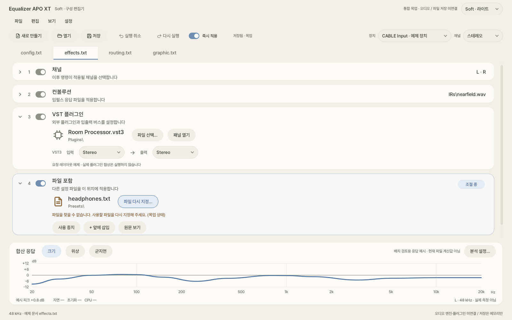
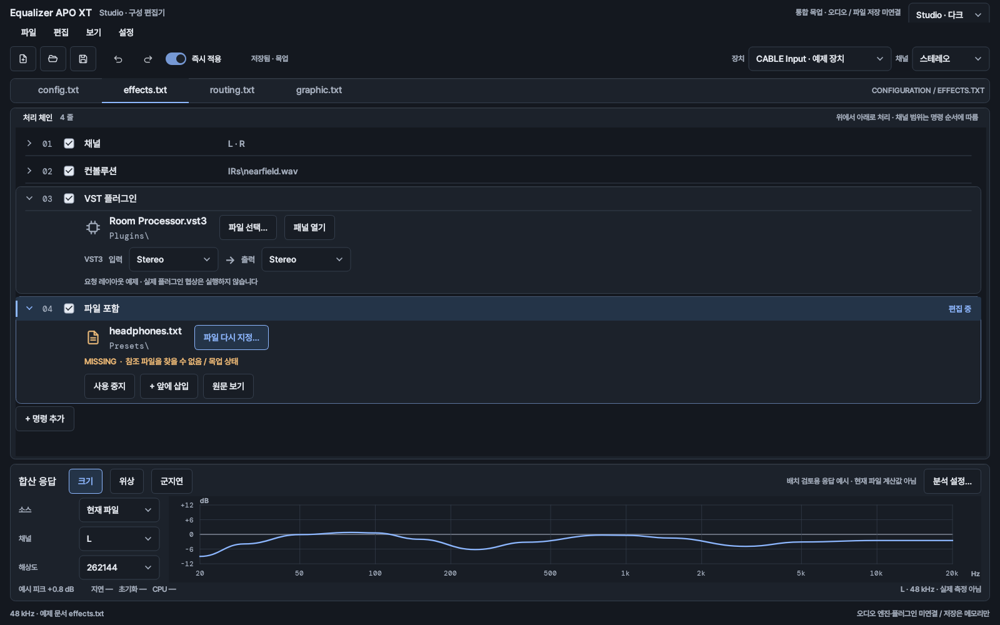

# Soft / Studio 통합 편집기 목업

2026-09-06 · `codex/issue-341-design-reframe`

필터 한 종류가 아니라 같은 편집기의 여러 요소를 함께 볼 수 있도록 확장했습니다. **Soft와 Studio는 별도 배치**를 사용합니다. 명령 데이터와 조작은 공유하지만, 행·숫자·필터 선택·라우팅·분석 설정의 표현은 각각 다르게 만들었습니다.

기존 Editor 코드는 수정하지 않았습니다. Qt로 실행되는 독립 목업이며, 실제 오디오 처리·디스크 저장·장치 열거·VST 로딩은 하지 않습니다. 기존 1·2차 이미지는 보존하고 이번 결과는 `images/integrated/`에 따로 생성했습니다.

## 같은 상황의 두 화면

### Soft



### Studio



Soft는 설명을 함께 읽는 두 줄 행, 몸통과 받침이 있는 손잡이, 둥근 파일 참조와 수식 블록을 유지합니다. Studio는 조밀한 명령 목록, 가라앉은 숫자창, 입출력 연결선, 상시 분석 설정으로 작업 정보를 빠르게 읽게 했습니다. 오류가 나면 두 스킨 모두 파일명 가까이에 복구 동작을 둡니다. 색 타일이나 광원을 추가해서 차이를 만들지는 않았습니다.

## 화면 목록

한꺼번에 큰 이미지를 모두 열지 않아도 비교할 수 있도록 링크로 정리했습니다. 기본 캡처는 1600×1000이고 작은 창은 1280×900입니다. 서로 같은 문서와 상태를 비교합니다.

| 상황 | Soft | Studio |
| --- | --- | --- |
| 기본 편집기·하이패스 편집 | [라이트](images/integrated/soft-light-config.png) | [다크](images/integrated/studio-dark-config.png) |
| 명령 추가 팝업 | [설명 중심 목록](images/integrated/soft-light-picker.png) | [목록 + 원문 미리보기](images/integrated/studio-dark-picker.png) |
| 파일 참조·VST 버스·결손 파일 | [라이트](images/integrated/soft-light-effects.png) | [다크](images/integrated/studio-dark-effects.png) |
| Device·Stage·Channel·Copy | [수식 블록](images/integrated/soft-light-routing.png) | [입출력 연결선](images/integrated/studio-dark-routing.png) |
| 그래픽 EQ 편집 | [라이트](images/integrated/soft-light-graphic.png) | [다크](images/integrated/studio-dark-graphic.png) |
| 분석 설정 팝업 | [라이트](images/integrated/soft-light-analysis-settings.png) | [다크](images/integrated/studio-dark-analysis-settings.png) |
| 작은 창의 라우팅 | [1280×900](images/integrated/soft-light-routing-1280.png) | [1280×900](images/integrated/studio-dark-routing-1280.png) |
| 작은 창의 파일 참조 | [1280×900](images/integrated/soft-light-effects-1280.png) | [1280×900](images/integrated/studio-dark-effects-1280.png) |
| 파일 복구 후 | [라이트](images/integrated/soft-light-recovered.png) | [다크](images/integrated/studio-dark-recovered.png) |
| 긴 한국어·영문 파일명 | [줄임 표시](images/integrated/soft-light-long-reference.png) | [줄임 표시](images/integrated/studio-dark-long-reference.png) |
| 반대 밝기 모드의 파일 참조 | [Soft 다크](images/integrated/soft-dark-effects.png) | [Studio 라이트](images/integrated/studio-light-effects.png) |

기본 config.txt는 앞선 목업의 13줄을 그대로 보존합니다. 나머지 세 문서는 요소 조합을 확인하기 위한 메모리상의 예제입니다. 기본 화면에서는 하이패스를 선택했고, 파일 참조 화면에서는 VST를 펼쳐 둔 채 결손 Include를 선택했습니다. 세로 스크롤 위치가 필요한 화면에서는 선택한 카드의 마지막 조작까지 보이도록 맞춥니다.

## 기존 요소와의 대응

| 기존 구현에서 확인한 요소 | 목업에서 연결한 내용 | 확인한 소스 |
| --- | --- | --- |
| 파일·편집·보기·설정 메뉴와 문서 탭 | 실제 Qt 메뉴와 독립 예제 문서 탭을 넣었습니다. | [MainWindow.ui](../../../Editor/MainWindow.ui) |
| 새 문서·열기·저장·실행 취소·다시 실행·즉시 적용·장치·채널 | 같은 명령 순서를 유지하고 스킨에 맞는 아이콘·스위치·선택기를 사용합니다. | [MainToolbarKit.cpp](../../../Editor/widgets/MainToolbarKit.cpp) |
| 명령 템플릿과 픽토그램 | 기존 카탈로그의 대표 템플릿 12개와 기존 SVG를 사용합니다. | [FilterCommandCatalog.cpp](../../../Editor/widgets/FilterCommandCatalog.cpp), [modern 아이콘](../../../Editor/icons/modern) |
| 카드 앞 삽입과 목록 끝 추가 | 선택 카드 앞 삽입과 끝 추가를 구분합니다. | [공통 규칙](../../skins/README.md) |
| 파일명·위치·메타데이터·찾기·열기 | 파일명과 복구 버튼을 가까이 두고 긴 이름은 가운데를 줄입니다. | [SoftReferenceCardView.cpp](../../../Editor/skins/soft/cards/SoftReferenceCardView.cpp) |
| VST 입력·출력 버스 | Auto·Mono·Stereo·5.1·7.1 요청 선택기를 넣었습니다. | [VSTPluginFilterGUI.cpp](../../../Editor/guis/VSTPluginFilterGUI.cpp) |
| Copy의 출력별 소스와 계수 | 동일한 L/R 혼합을 Soft 수식 블록과 Studio 연결선으로 나눴습니다. | [BlockChipRoutingRenderer.cpp](../../../Editor/skins/soft/routing/BlockChipRoutingRenderer.cpp) |
| GraphicEQ 가변·15·31대역과 지점 편집 | 지점 선택·게인 입력·드래그·방향키 조절과 대역 수 변경을 넣었습니다. | [GraphicEQFilterGUI.ui](../../../Editor/guis/GraphicEQFilterGUI.ui) |
| 분석 소스·채널·해상도·크기·위상·군지연 | Studio에는 설정을 상시 표시하고 Soft에는 별도 설정 팝업을 둡니다. | [MainWindow.ui](../../../Editor/MainWindow.ui), [StudioSkin.Analysis.cpp](../../../Editor/skins/studio/StudioSkin.Analysis.cpp) |

기존 gallery-refine-r1의 필터 픽커, Copy, 컨볼루션, VST 카드도 직접 확인했습니다. 갤러리에는 현재 공통 규칙보다 이전의 오른쪽 관리 버튼 배치가 포함되어 있어, 배치 판단은 현재 코드와 규칙을 함께 확인했습니다.

## 2차 목업에서 바꾼 부분

### 편집기 전체와 조작 흐름

| Before | After |
| --- | --- |
| 독립 필터 목록과 파일명만 있습니다. | 메뉴·도구 모음·문서 탭·장치와 채널 선택·즉시 적용·분석 설정을 포함합니다. |
| 추가·삭제가 비활성 자리표시자입니다. | 추가·삭제·실행 취소·다시 실행을 메모리 모델에 연결했습니다. |
| 설정 파일은 한 개입니다. | config/effects/routing/graphic 문서를 전환하며 각각의 편집 내용과 변경 상태를 유지합니다. |
| 모든 드롭다운에 Qt 기본 화살표 칸이 남습니다. | 각 스킨의 면·모서리·포커스와 일치하는 선택기로 그립니다. |
| 즉시 적용은 기본 체크박스입니다. | 스킨의 스위치 표현을 사용하되 실제 적용과는 분리합니다. |
| 펼친 카드 모두가 선택된 것처럼 보일 수 있습니다. | 펼침과 선택을 구분하고 ‘조절 중’ 및 공통 편집 버튼은 선택 카드에만 표시합니다. |
| Studio의 접기 화살표가 선택 여부를 따릅니다. | 실제 펼침 상태를 따르도록 수정했습니다. |

### 전문 편집 요소와 상태

| Before | After |
| --- | --- |
| Include는 간단한 문장으로만 표시합니다. | 파일명·위치·결손·복구·예제 내용 열기를 포함합니다. |
| VST·컨볼루션 조합이 없습니다. | 참조 파일을 나란히 검토할 수 있고 VST 버스 요청과 IR 예제 메타데이터를 표시합니다. |
| 파일 선택 버튼이 이름과 멀어질 수 있습니다. | 파일명 가까이에 붙이고 긴 이름은 폭을 제한해 줄입니다. 원문은 툴팁에 남깁니다. |
| Copy는 원문 요약뿐입니다. | 계수 편집이 실제 화면의 수식·연결선·요약·실행 취소에 반영됩니다. |
| 그래픽 EQ는 요약만 있습니다. | 별도 지점 편집 그래프와 게인 입력을 제공합니다. |
| 보조 숫자 입력에 기본 스텝퍼가 남습니다. | 조절부와 같은 둥근 입력창 또는 가라앉은 숫자창으로 통일합니다. 키보드·휠 조작은 유지합니다. |
| 분석은 합산 응답 하나뿐입니다. | 소스·채널·해상도·지연 포함 설정과 크기/위상/군지연 진입점을 보입니다. 단위도 명시합니다. |
| 복구 후 상태와 긴 이름을 검토하지 않습니다. | 복구 후 및 긴 한국어·영문 이름의 별도 캡처와 자동 검사를 추가합니다. |

## 두 안의 설계 차이

| 요소 | Soft | Studio |
| --- | --- | --- |
| 목록 | 설명을 함께 읽는 두 줄 카드입니다. | 값과 순서를 비교하는 조밀한 목록입니다. |
| 기본 조절부 | 큰 몸통 손잡이 아래에 값을 둡니다. | 가는 호 옆에 숫자창을 둡니다. |
| 파일 참조 | 파일 아이콘·이름·위치를 친숙한 행으로 보여줍니다. | 파일 정체성과 경로·상태를 분리해 읽게 합니다. |
| 오류 | 짧은 설명과 복구 버튼을 강조합니다. | 짧은 상태 코드와 복구 버튼을 강조합니다. |
| Copy | 출력별 수식 블록과 채널 이름으로 읽습니다. | 입력부터 출력까지 연결선으로 추적합니다. |
| 명령 선택 | 설명 중심의 두 줄 목록입니다. | 조밀한 목록과 원문 미리보기를 나란히 둡니다. |
| 분석 설정 | 필요할 때 팝업으로 엽니다. | 소스·채널·해상도를 그래프 옆에 상시 둡니다. |

여기서 같은 모양으로 남겨야 할 부분도 있습니다. 명령 순서, 삽입 위치의 뜻, 키보드 조작, 파일의 상태와 오류의 의미까지 스킨별로 바꾸지는 않았습니다. 차이는 표현과 정보 밀도에 두었습니다.

## 동작과 검증

Qt 6.10.1 / MSVC에서 빌드했습니다. 통합 목업의 자동 검사 **60개**가 통과했습니다. 두 스킨에 동일한 검사를 적용했습니다. [기계 판독용 결과](images/integrated/qa.json)를 남겼습니다.

검사는 메뉴·탭 존재, 검색과 빈 결과, 앞 삽입, 삭제, undo/redo, 파일 복구, 버스 요청 변경, 라우팅 계수 편집과 취소, 그래픽 EQ 지점·키보드 편집, 파일 간 상태 보존, 분석 설정, 1280px에서 실제 선택기 경계, 긴 이름의 폭 제한, 반복 재생성 시 위젯 수를 확인합니다. 앞선 단독 목업의 검사 42개도 별도로 통과했습니다.

대표 라이트/다크 전체 화면과 픽커·라우팅·그래픽 EQ·파일 참조·긴 이름의 렌더를 직접 확인하며 수정했습니다. 모든 이미지가 사람의 사용성 평가를 통과했다는 뜻은 아닙니다. 실제 모니터의 DPI 전환·스크린리더·대형 설정 파일에서의 성능은 시험하지 않았습니다.

## 명확히 남겨 둔 한계

합산 응답은 배치 검토를 위한 예시입니다. 현재 문서를 계산한 결과가 아니라고 화면에 표시합니다. 위상·군지연에는 가짜 데이터를 넣지 않고 엔진 연결이 필요함을 표시합니다. 지연·초기화·CPU 측정값도 만들지 않았습니다. 그래픽 EQ의 연결선은 편집 지점 표시이며 실제 FIR 응답이 아닙니다. 15/31대역은 대역 수 전환을 보는 예제이지 실제 기본 주파수표와 처리 엔진을 이식한 것이 아닙니다.

파일 열기·저장은 메모리상의 예제만 대상으로 합니다. Include 내용을 열면 해당 이름의 예제 탭을 만듭니다. 장치 목록은 고정 예제이며 실제 장치를 열거하거나 적용하지 않습니다. VST 버스는 요청 상태만 바뀌고 실제 협상·로딩은 수행하지 않습니다. 외부 VST 고유 창의 내부 디자인은 편집기 스킨이 소유하지 않는 영역이므로 별도로 안내합니다.

아직 다루지 않은 요소는 전체 메뉴 항목·클립보드·드래그 재정렬, MultiConvolution의 다중 파일·고정 소스 매핑, VST 채널 슬롯 채우기·전체 버스 조합, SubwooferRouting, Hilbert/Velvet/Loudness 상세 편집, If/Else 중첩, 분석 패널의 상단·우측 도킹, 실제 운영체제 파일 대화상자, 별도 DeviceSelector·UpdateChecker 앱입니다. 이번 결과를 전체 Editor의 완성된 대체 구현이라고 부르지는 않습니다.

스킨 규칙에서는 앞선 제안과 마찬가지로 상시 발광·다색 배지·모든 헤더 버튼 반복을 그대로 따르지 않았습니다. 실제 제품 반영 시 공통 카드 규칙 변경과 나머지 명령의 상태 대응을 함께 검토해야 합니다.

## 실행

```powershell
./tools/mockups/issue341/build.ps1 -Study -Render -Test
./tools/mockups/issue341/run.ps1 -Study -Theme soft-light
./tools/mockups/issue341/run.ps1 -Study -Theme studio-dark
```

`-Study`를 빼면 앞선 단독 목업을 엽니다. 두 스킨의 상위 배치는 [SoftEditorStudy.h](../../../tools/mockups/issue341/SoftEditorStudy.h)와 [StudioEditorStudy.h](../../../tools/mockups/issue341/StudioEditorStudy.h)에 분리했습니다. [EditorStudy.h](../../../tools/mockups/issue341/EditorStudy.h)는 문서·편집·팝업 흐름, [StudyEditors.h](../../../tools/mockups/issue341/StudyEditors.h)는 전문 편집 요소, [StudySurfaces.h](../../../tools/mockups/issue341/StudySurfaces.h)는 각 스킨의 그리기를 담당합니다.
